# Hola, I'm [Jay Deng](https://github.com/naj1n)

- 🤖 Full stack Developer.
- 🌱 I’m currently learning [AutoGen](https://github.com/microsoft/autogen), [smolagents](https://github.com/huggingface/smolagents), [Mastra](https://github.com/mastra-ai/mastra)
- 📫 How to reach me: [Twitter](https://twitter.com/ejaydng), [Calendly](https://calendly.com/naj1n), [Mail](mailto:contact@jaydeng.me)
- 😄 Pronouns: He/him.

**Languages and Tools:**

<code></code>
<code></code>
<code></code>
<code></code>
<code></code>
<code></code>
<code></code>
<code></code>
<code></code>
<code></code>
<code></code>
<code></code>
<code></code>

Coding Metrics:

